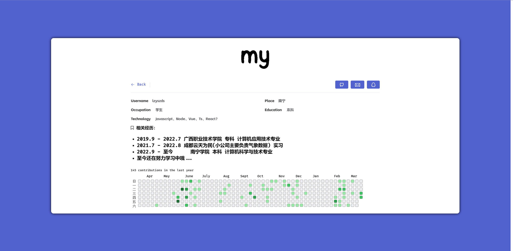
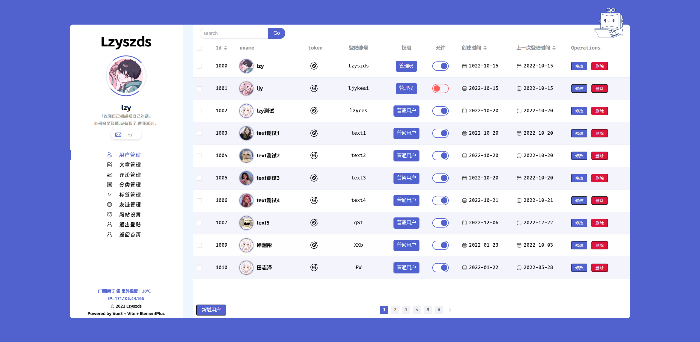
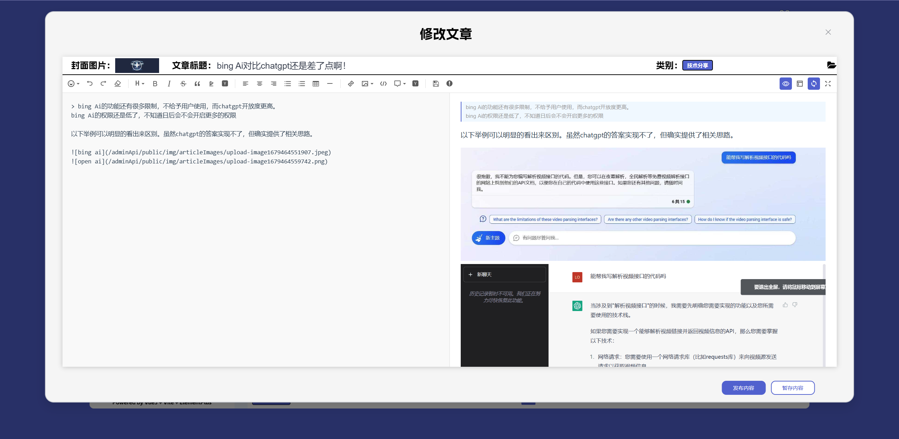

# weboke

🐣基于vue3+vite2+TS的可视化博客系统

  

    
    
    
    

## 安装教程

1. node.js
2. vite
3. vue3
4. 建议全局安装ni ni可以快捷的在vscode里实现运行、安装、打包等  `npm i -g @antfu/ni`

#### 使用说明

1. 终端运行npm install || yarn install (建议用yarn，不会出现问题)
2. 启动方式：终端运行npm run serve || yarn serve
3. 打包方式：终端运行npm run build || yarn build

## 系统效果

  
首页

  

  
首页

  

  
首页

  

  
首页

  

  
首页

  

  
首页

  

## git使用方式

1. 克隆到本地 ：
`git clone 'https://gitee.com/lzy-Team/weboke.git'`
2. 将要提交的代码放入暂存区 ：
`git add .`
3. 将暂存区的代码存入本地git上( -m 表示分支) :
`git commit -m '备注必须要写'`
4. 提交到git仓库（网络上）:
`git push`
5. 拉取最新代码：
`git pull`
