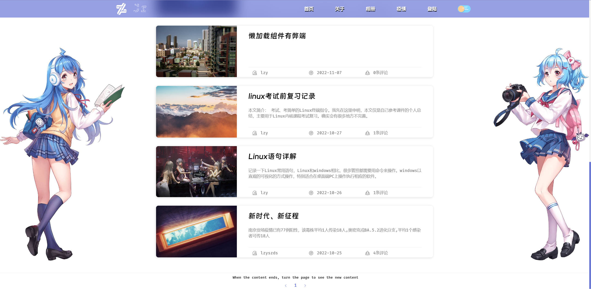
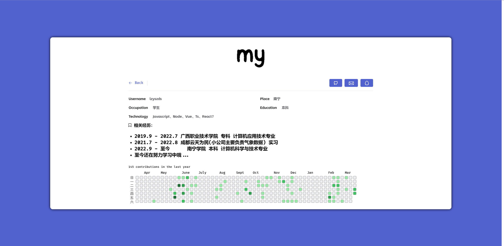
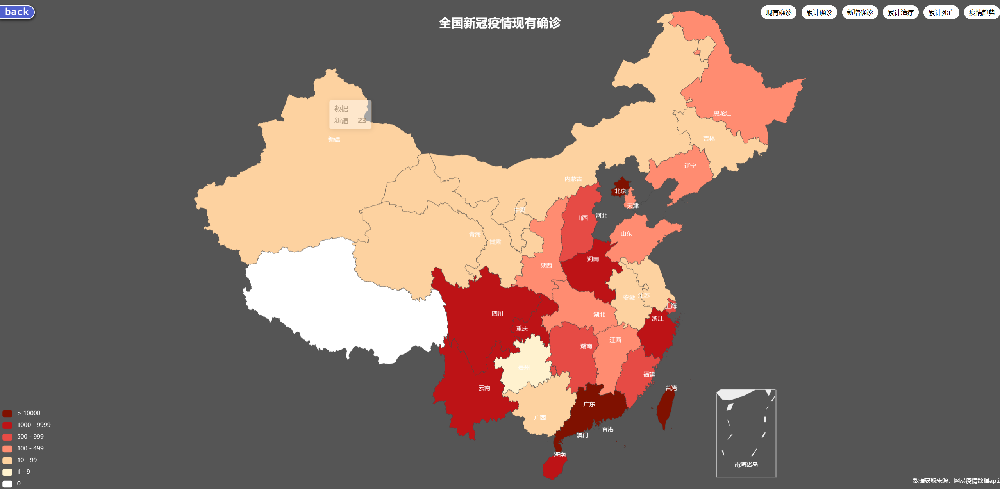
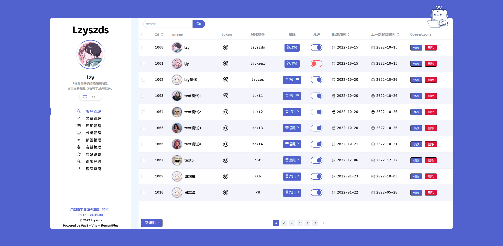
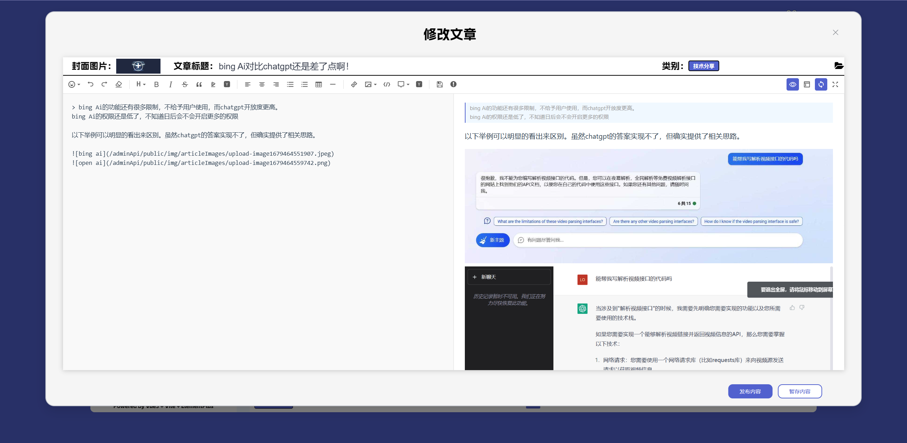

# weboke

🐣基于vue3+vite2+TS的可视化博客系统

  

    
    
    
    

## 项目问题

❌❌❌暂未解决
项目在服务器上图片缓存问题，因为图片不会自动缓存，因为是在服务器上的问题。
图片只要在项目中加载过，就不需要重新进行加载，只需要去调用缓存就行了。

解决办法： 将图片转为 base64 格式，然后在项目中进行加载，存放进 new Map() 中，然后在项目中进行调用。
每次加载图片的时候，先去 Map 中查找，如果有就直接调用，如果没有就进行加载。

## 安装教程

1. node.js
2. vite
3. vue3
4. 建议全局安装 ni ni 可以快捷的在 vscode 里实现运行、安装、打包等 `npm i -g @antfu/ni`

#### 使用说明

1. 终端运行 npm install || yarn install (建议用 yarn，不会出现问题)
2. 启动方式：终端运行 npm run serve || yarn serve
3. 打包方式：终端运行 npm run build || yarn build

## 系统效果

  
  
  
  
  
  

## git 使用方式

1. 克隆到本地 ：
   `git clone 'https://gitee.com/lzy-Team/weboke.git'`
2. 将要提交的代码放入暂存区 ：
   `git add .`
3. 将暂存区的代码存入本地 git 上( -m 表示分支) :
   `git commit -m '备注必须要写'`
4. 提交到 git 仓库（网络上）:
   `git push`
5. 拉取最新代码：
   `git pull`
